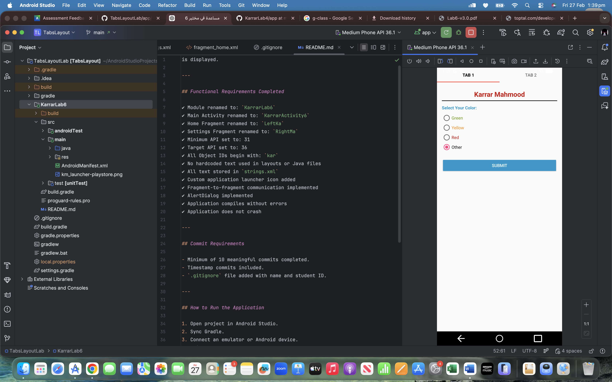

Karrar Mahmood - n01641132

This project implements a TabsLayout Android application for Lab 6 using ViewPager2 and TabLayout to allow communication between two fragments.

GitHub Repository Link:
https://github.com/karrar7311/TabsLayoutLab

---

## Project Description

This application contains two tabs:

### TAB 1 (Left)
- Allows the user to select a color using RadioButtons.
- Green is selected by default.
- When the user clicks SUBMIT:
    - A Toast message displays the selected color.
    - The selected color is passed to TAB 2.

### TAB 2 (Right)
- Displays the color passed from TAB 1.
- If no data is received, "NO DATA" is shown in gray color.
- Includes three CheckBoxes:
    - Hockey
    - Basketball
    - Baseball
- Includes a SPORT button.
- When clicked:
    - Selected sports are displayed in an AlertDialog.
    - If nothing is selected, "NO SPORT" is shown.

---

## Application Configuration

- Minimum SDK Version: 31
- Target SDK Version: 36
- Java Version Updated
- Deprecated APIs Removed
- Custom Application Icon Applied
- Supports English and French (First 3 strings translated)

---

## How to Run the Application

1. Open the project in Android Studio.
2. Sync Gradle files.
3. Connect an Android device or emulator.
4. Click Run App.

---

## Application Screenshot

---

## Status

Application compiles successfully and runs without crashing.
Minimum of 10 meaningful commits completed.
.gitignore file added with name and student ID.
README.md added at project level.